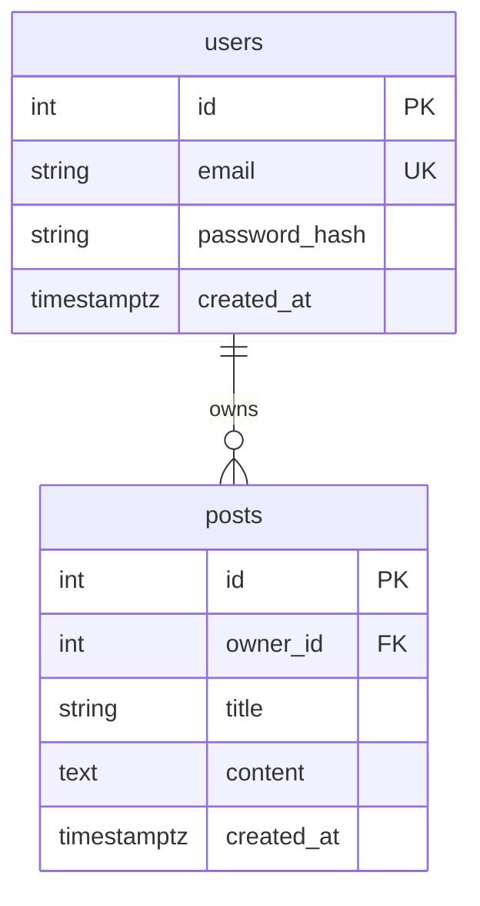

# ERD (Text + Mermaid)

**Entities**

- **users**
  - id (PK, int)
  - email (unique, indexed, varchar(255))
  - password_hash (varchar(255))
  - created_at (timestamptz, default now())

- **posts**
  - id (PK, int)
  - owner_id (FK -> users.id, on delete cascade, indexed)
  - title (varchar(200))
  - content (text)
  - created_at (timestamptz, default now())
  - UNIQUE(owner_id, title) to prevent duplicate-titled posts per user

**Relationships**

- users (1) —— (N) posts

